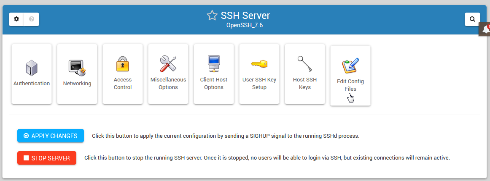

# Material Design Extension for Webmin

CSS Extension for adding Material Design elements to Webmin Authentic Theme.

Also adds padding to make UI easier to work with.

This CSS can be added to Webmin Authentic Theme via Webmin > Webmin Configuration > Webmin Themes

